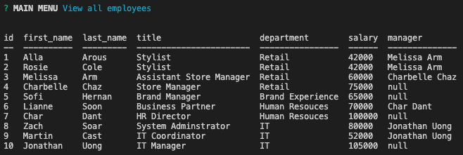

# Employee-Tracker

This Node application is for a business owner to be able to view and manage departments, roles, and employees in their company in order to organize and plan their business.

The application gives yout the following options:
* View all employees with the option by role, department, or manager
* Add an employee, role, or department
* Update an employee role or manager
* Delete employee, role, or department
* View department salary budgets

## Installation
---
1. Run `npm install` to install all dependencies
2. Run `schema.sql` in MySQLWorkbench
    * (Optional) Run `seeds.sql` in MySQLWorkbench
3. Edit MySQL connection properties in the `connectionProperties` object in `employee-tracker.js`

## Usage
---
1. Run `node employee-tracker.js` to start the application
2. Select from the menu to view, add, remove, or update employees, roles, departments, or managers

    

3. Follow prompt if presented

    

## Tool & Resources
---
* [Node.js](https://nodejs.org/en/) - JavaScript runtime environment
* [MySQLWorkbench](https://www.mysql.com/products/workbench/) - Visual database design tool
    ### Dependencies
    ---
    * [inquirer](https://www.npmjs.com/package/inquirer) - For the CLI user interface. This will prompt user within the CLI for employee information.
    * [console.table](https://www.npmjs.com/package/console.table) - Used to print MySQL into tables to the console.
    * [mysql](https://www.npmjs.com/package/mysql) - Used to connect to the MySQL database and perform queries
    * [promise-mysql](https://www.npmjs.com/package/promise-mysql) - Used to create promises from MySQL queries 

## Assignment Challenges
---
### Struggle 1: Queries

The most difficult part of this assignment was learning how to query and quering correctly. I knew this was going to be the most difficult this was the first thing I did, to find the right query. I understood the concept of the JOINs but I did not understand the query code of it.

### Struggle 2: SQL Async Issue

An issue I was having was trying to query and promising a return right after. I was not able to figure out now to make the query into a promise, so I used promise-sql package. This helped with promises

### Struggle 3: Passing two arguments through a promise.

This took me a while to figure out but decided to do this route:

    ```javascript
    return Promise.all([
            conn.query('SELECT id, title FROM role ORDER BY title ASC'), 
            conn.query("SELECT employee.id, concat(employee.first_name, ' ' ,  employee.last_name) AS Employee FROM employee ORDER BY Employee ASC")
        ]);
    }).then(([roles, managers]) => {
    ```